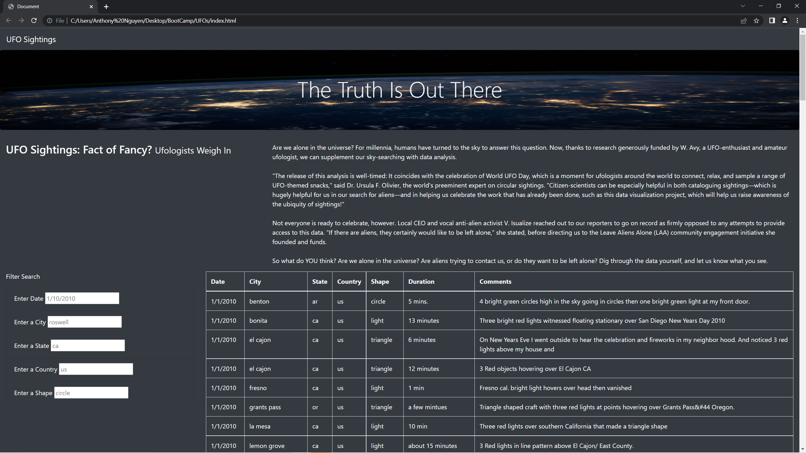
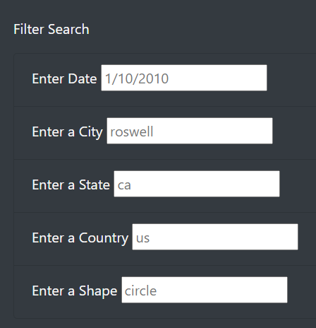

# UFOs
## Overview
Using javascript and html we will create a wepage to display our filterable table. Users will have options to change the criteria for their search as long as it's within the parameters

## Results

Upon visiting the page you can see that the theme is dark and everything fits within the screen. This is through the use of CSS.

To filter through the table we enter our search criteria in the boxes and after the user makes and input, the table is updated using the filtered data.

## Summary
One drawback of this webpage is the precision required when entering search critera. If search parameters don't match the data exactly, nothing will show up.

For instance, when looking at UFO sightings in California, typing in California or even Ca will produce 0 results.

To improve the our filterable table, we could write more code to accept other forms of spelling to still provide the same results.
Quite often when people see these UFO sightings, they take pictures. If pictures were available we could host those and provide a link to be able to navigate to the corresponding pictures.
